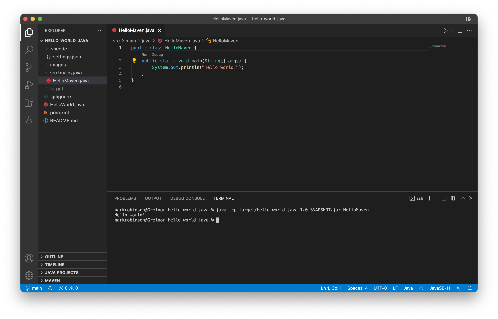

# hello-world-java

1. download and install the VS Code Extension Pack for Java
	https://code.visualstudio.com/docs/java/java-tutorial

2. If you don't have a JDK installed, VS Code will display a button to Install a JDK 
	

	You may need to restart VS Code if you installed a fresh JDK

3. click on Source Control in the sidebar, then the ellipses periods in the command palette, then on "Clone" 
	

	As with hello-world-js, select a location to clone the project and click on "Trust the authors"

4. double-click HelloWorld.java in the Project Explorer on the left side to open the file (see image_13)
	

5. click Run on the menu and then click Run Without Debugging 
	

6. you should see the program output in the terminal 
	

7. hello-world-java also has a Maven pom file and a HelloMaven.java file in its source tree. You can build hello-world as a Maven project by typing "mvn package" in the terminal 
	

8. run HelloMaven by typing:
	java -cp target/hello-world-java-1.0-SNAPSHOT.jar src.main.java.HelloMaven 

	